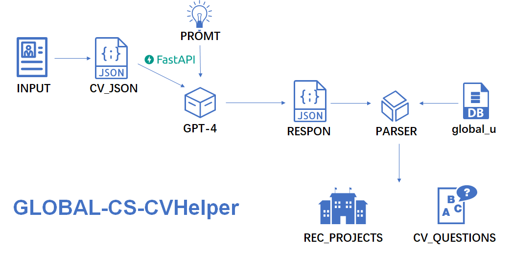
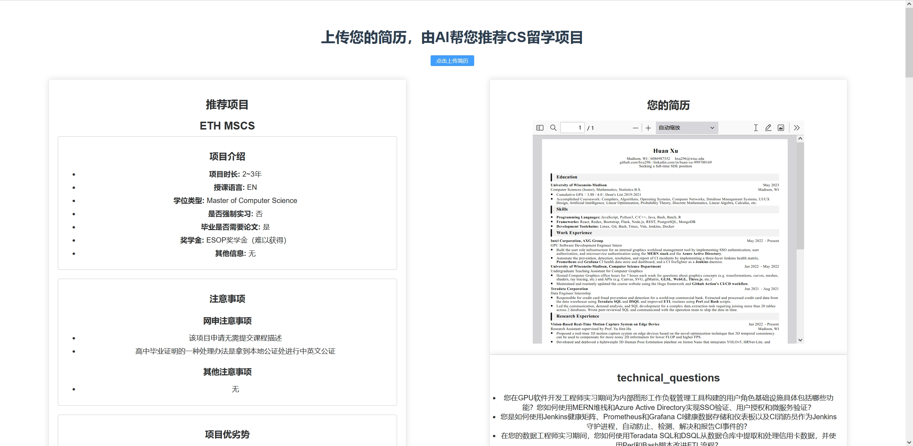
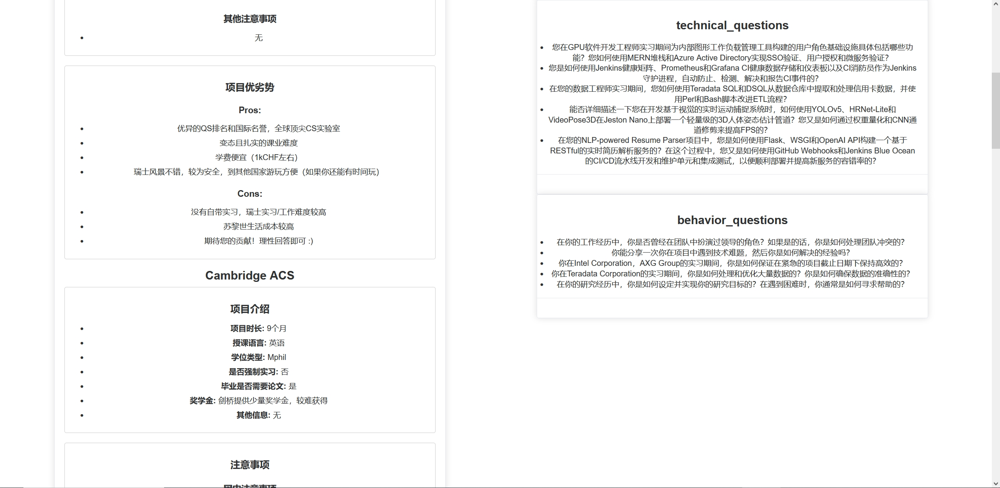

# GLOBAL-CS-CVHelper


让 AI 为您解决CS留学项目选择问题！
<br>
<br>
CVHelper提供了一系列的工具实现从【您的简历】-->>【推荐的CS留学项目】的流程！


1.基于typer的命令行界面（CLI）工具，旨在通过根据候选人的简历自动生成可能的面试问题：包括简历JSON解析器、基于GPT-4的简历解析器。

2.提供一个可视化Web界面，上传简历，即可生成你的专属推荐留学项目。

3.构建了留学项目数据库，感谢[Global-CS](https://global-cs-application.github.io/)提供的原始数据。

## How it works？



## 特点 ✨
* 解析 PDF 格式的简历文件并将其转换为 JSON 格式
* 根据从简历中提取的信息生成面试问题，用于申请人自测
* 基于 FastAPI+Vue 的前后端完整的用户界面，用于生成推荐的CS留学项目👉 [项目配套前端链接](https://github.com/Hackerismydream/GLOBAL-CS-CVHelper-Fronted)
* 真实可靠的留学数据，并以GPT-4作为分析模型，目前已录入

## 依赖项
* Python 3.10 
* typer
* OpenAI
* FastApi
* SQLAlchemy

## 安装

1. 克隆仓库：
```bash
git clone https://github.com/Hackerismydream/ResumeHelper
```

2. 安装依赖项
```bash
pip install -r requirements.txt
```
3. 创建数据库及表

更改application/createDB.py中的数据库用户及密码

运行application/createDB.py文件,会自动创建数据库并根据json文件中的数据写入数据


## 使用

### 使用Vue+element-ui界面

要启动基于 FastApi+Vue 的用户界面，根据用户的简历生成个性化面试问题

请先在终端中执行以下命令启动后端服：
```bash
uvicorn main:app --reload
```
运行命令后，FastApi 将会启动

之后启动前端项目👉 [项目配套前端链接](https://github.com/Hackerismydream/GLOBAL-CS-CVHelper-Fronted)
```bash
yarn serve
```
项目页面会在您的默认网络浏览器中启动，允许您上传 PDF 格式的简历并生成推荐。




### 使用CLI

CLI 中有两个主要命令：
1. q：根据从简历中提取的信息生成面试问题
2. json：将简历 PDF 文件解析为 JSON 格式
3. g：解析简历PDF，并根据留学申请历史数据生成推荐项目
### 从简历生成推荐的CS留学项目（CLI）
```json
{
    '推荐院校': ['ETH MSCS', 'Cambridge ACS', 'EPFL MSCS', 'IC AC', 'UvA AI'],
    '推荐理由': [
        '候选人在美国威斯康星大学麦迪逊分校（University of Wisconsin-Madison）获得计算机科学（荣誉）、数学、统计学士学位，该校在全球大学排名中位列前50，与历史申请成功人的学校档次相当。',
        '候选人的GPA为3.88/4.0，与历史申请成功人的GPA相当，且连续多年获得院长名单荣誉，表明其在学术上的优秀表现。',
        '候选人具有丰富的科研经历，包括在计算机图形学、基于视觉的实时运动捕捉系统、基于视觉的工作风险评估系统等方向的研究，这些经历与历史申请成功人的科研经历相当。',
        '候选人在英特尔公司和Teradata公司担任软件开发工程师实习生和数据工程师实习生，这些实习经历与历史申请成功人的实习经历相当。',
        '候选人具有丰富的项目经验，包括NLP-powered Resume Parser和Stock Drop Notifier等项目，这些经验将有助于其在申请的项目中表现出色。',
        '综上，候选人的学校档次、专业、GPA、科研经历、实习经历等指标均与历史申请成功人的相应指标高度匹配，因此推荐其申请ETH MSCS、Cambridge ACS、EPFL MSCS、IC AC、UvA AI等项目。'
    ]
}
```
### 从简历生成可能的面试问题（CLI）
```bash
python cli.py q <file_path>
```
```json
{
    'technical_questions': [
        '您在使用MERN堆栈和Azure Active Directory时，遇到了哪些挑战？您是如何解决这些挑战的？',
        '在您担任计算机图形学助教期间，您遇到了哪些常见的学生问题？您是如何解决这些问题的？',
        '在您的数据工程实习期间，您使用了哪些ETL工具和技术来处理信用卡数据？您是如何确保数据的准确性和安全性的？'
    ],
    'behavior_questions': [
        '请描述一次您在工作中遇到的团队冲突，并说明您是如何处理的？',
        '在您的研究助理角色中，您是如何与导师和其他团队成员合作的？请分享一个具体的例子。',
        '在您的项目经验中，您是如何管理时间和任务的？请分享一个您成功完成项目的例子，并解释您是如何组织和分配工作的。'
    ]
}

```

### 从简历生成 Json 输出（CLI）
```bash
python cli.py json <file_path>
```
```json
{
    'personal_detail': {
        'first_name': 'Huan',
        'last_name': 'Xu',
        'email': 'hxu296@wisc.edu',
        'phone_number': '6086987552',
        'location': 'Madison, WI',
        'portfolio_website_url': 'github.com/hxu296',
        'linkedin_url': 'linkedin.com/in/huan-xu-999700169',
        'github_main_page_url': 'github.com/hxu296'
    },
    'education_history': [{'university': 'University of Wisconsin-Madison', 'education_level': 'B.S.', 'graduation_year': '2023', 'graduation_month': 'May', 'majors': 'Computer Sciences (honor), Mathematics, Statistics', 'GPA': '3.88 / 4.0'}], 
    'work_experience': [
        {
            'job_title': 'GPU Software Development Engineer Intern',
            'company': 'Intel Corporation, AXG Group',
            'location': '',
            'begin_time': 'May 2022',
            'end_time': 'Present',
            'job_summary': 'Built the user role infrastructure for an internal graphics workload management tool by implementing SSO authentication, user authorization, and microservice authentication using the MERN stack and the Azure Active  
Directory, Automate the prevention, detection, resolution, and report of CI incidents by implementing a three-layer Jenkins health matrix, Prometheus and Grafana CI health data store and dashboard, and a CI firefighter as a Jenkins daemon.'    
        },
        {
            'job_title': 'Undergraduate Teaching Assistant for Computer Graphics',
            'company': 'University of Wisconsin-Madison, Computer Science Department',
            'location': '',
            'begin_time': 'Jan 2022',
            'end_time': 'May 2022',
            'job_summary': "Hosted Computer Graphics office hours for 7 hours each week for questions about graphics concepts (e.g. transformations, curves, meshes, shaders, ray tracing, etc.) and APIs (e.g. Canvas, SVG, glMatrix, GLSL, WebGL, 
Three.js, etc.) Maintained and routinely updated the course website using the Hugo framework and Github Action's CI/CD workflow"
        },
        {
            'job_title': 'Data Engineer Internship',
            'company': 'Teradata Corporation',
            'location': '',
            'begin_time': 'Jun 2021',
            'end_time': 'Aug 2021',
            'job_summary': 'Responsible for credit card fraud prevention and detection for a world-top commercial bank. Extracted and processed credit card data from the data warehouse using Teradata SQL and DSQL and improved ETL routines using
Perl and Bash scripts. Led the communication, demand analysis, and SQL development for a complex data extraction task requiring joining more than 20 tables across 2 databases. Wrote peer-reviewed SQL and communicated with the operation team to 
ship the data in time.'
        }
    ],
    'project_experience': [
        {
            'project_name': 'Vision-Based Real-Time Motion Capture System on Edge Device',
            'project_description': 'Proposed a real-time 3D motion capture system on edge devices based on the novel optimization technique that 3D temporal consistency can be used to compensate for more noisy 2D information for lower FLOP and 
higher FPS. Developed and deployed a lightweight 3D Human Pose Estimation pipeline on Jeston Nano that integrates YOLOv5, HRNet-Lite, and VideoPose3D using Docker and TensorRT and improved FPS by weight quantization and CNN channel pruning.'   
        },
        {
            'project_name': 'Synthetic Pretraining for Robust 3D Human Pose Estimation',
            'project_description': 'Served as the 3rd author for the journal paper Learning from Synthetic Humans for Accurate and Generalizable 3D Pose Estimation targeting IEEE Transactions on Image Processing, Synthesized realistic 2D       
keypoints to pretrain 3D estimators and showed a significant decrease of PA-MPJPE from 68.0 mm to 61.3 mm on the 3DPW dataset compared with the pretrained-with-H36M baseline. Spearheaded the development of a graphic rendering pipeline that     
infers human mesh from 3D human joints and shapes, and calculates dense depth maps with respect to sampled camera views by using OpenGL, Pytorch, and Scipy.'
        },
        {
            'project_name': 'Vision-Based Job Risk Assessment System for Manual Material Handling',
            'project_description': 'Served as the 3rd author for the journal paper A Single-Camera Method for Estimating Lift Asymmetry Angles using Deep Learning Computer Vision Algorithms targeting The Journal of the Human Factors and        
Ergonomics Society, Collaboratively proposed a non-intrusive, visioned-based system to estimate the Body Asymmetry Angle by using pre-trained 3D Human Pose Estimators. Verified experiment results by setting up and running 6 human pose 
estimation methods on Unix-based OS with Docker and Anaconda and showed that our method produces statistically more accurate results than the previous SOTA by using the paired t-test.'
        },
        {
            'project_name': 'NLP-powered Resume Parser',
            'project_description': "Architected a RESTful real-time resume parsing service that leverages OpenAI's Natural Language Processing engine GPT-3 by using Flask, WSGI, and OpenAI API. Developed and maintained unit and integration     
tests with GitHub Webhooks and Jenkins Blue Ocean's CI/CD pipeline to smoothen deployment and improve fault tolerance for the new service."
        },
        {
            'project_name': 'Stock Drop Notifier',
            'project_description': 'Built a customizable stock notifier for Newegg and BestBuy with a Telegram command-line interface that allows users to personalize search filters, fire up notifiers, and receive notifications all through 1   
Telegram bot account by using Scrapy, Selenium, BeautifulSoup, Regex, Requests, and the Python-Telegram-Bot API.'
        }
    ]
}
```

## ABOUT DB

目前已更新至以下项目：
* Cambridge ACS
* ETH MSCS
* Cambridge MLMI
* EPFL MSCS
* ETH Cyber Security
* Oxford ACS
* Aalto CS
* IC AC
* TUD MSCS
* UvA AI
* CTH CAS
* NUS DSML
* UvA&VU CS
* IPP DSAI
